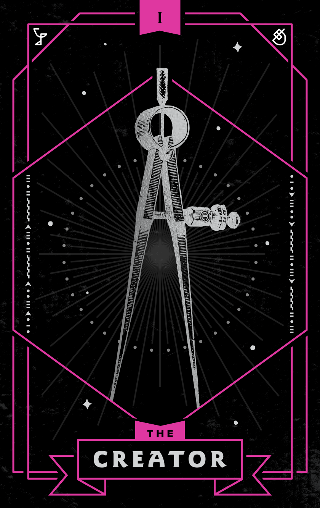
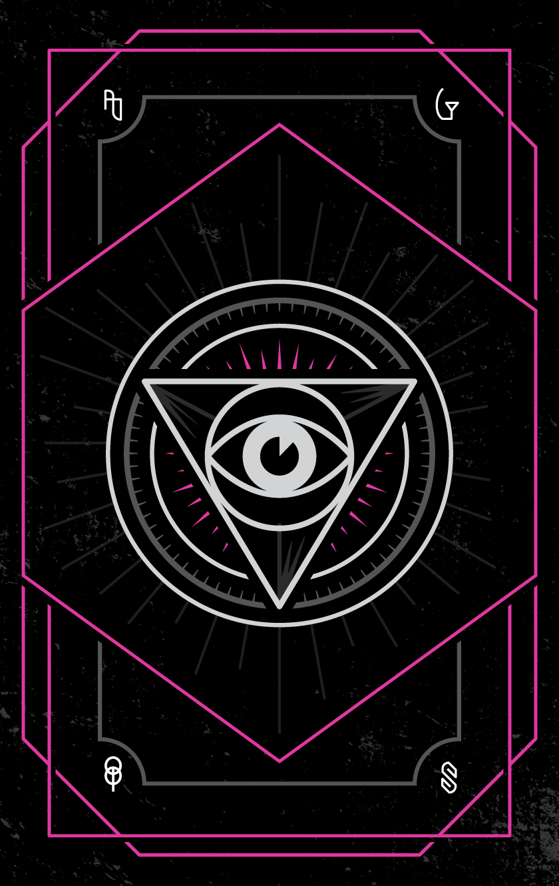

    <h1>About the Order</h1>

    

        

            
The uninspired <strong>envy us.</strong>

            
The shrewd <strong>support us.</strong>

            
The creative <strong>join us.</strong>

        

        
<strong>Since the advent of time, we’ve been here.</strong> Observing and influencing, shrouded in shadows. Prying into the hopes and pulling on the heartstrings of humanity. Calling multitudes to action and guiding their destinies &mdash; without their even knowing it.

        
Faced with mediocrity, we are militant. From blank nothingness, we birth creation. And staring into the gaping maw of deadlines, we deliver. Though our earthly bodies are rarely seen, the fruits of our labor are omnipresent.

        
<strong>WE ARE THE ORDER OF THE ETERNAL EYE.</strong>

        

        <h2 class="gold" style="margin-top:7rem;margin-bottom: .5rem;">Who We Are</h2>
        
Our members are many, but our vision is one.

    

<!--

    

        <a class="tarot-choice creator active" href="#creator">
            
            
            
Creator

        </a>
        <a class="tarot-choice scribe disabled">
            
            
            
?

        </a>
        <a class="tarot-choice seer disabled">
            
            
            
?

        </a>
        <a class="tarot-choice ancillary disabled">
            
            
            
?

        </a>
        <a class="tarot-choice herald disabled">
            
            
            
?

        </a>
        <a class="tarot-choice keeper disabled">
            
            
            
?

        </a>
        <a class="tarot-choice observer disabled">
            
            
            
?

        </a>
        <a class="tarot-choice technician disabled">
            
            
            
?

        </a>     
    

    

        

            
The Creator

            
An Eye For Elegance.

            
Divinely inspired, and unflinchingly artistic, the CREATOR births deliberate design that captivates. From steady hands, fine lines, ornate flourishes and hypnotic bursts of colour spring forth. Should you fall under their spell, fear not. Such beauty tends to work its way under the skin.

            <h3 style="font-size: 1rem;margin-bottom: .5rem;">Legendary Creators</h3>
            
Georgia O'Keeffe 
                Milton Glaser 
                The Lord, Himself
            

            <h3 style="font-size: 1rem;margin-bottom: .5rem;">Personal Motto</h3>
            
<em>"Do you want it right now, or do you want it right?"</em>

        

        

            

                
                
            

        

    

-->

    

        

            <a class="tarot-choice" :class="[card.name, card.name === currentCard.name ? 'active' : '', card.disabled ? 'disabled' : '']"  v-bind:href="!card.disabled ? '#/' + card.name : ''">
                
                
                
?

                
{{card.name}}

            </a>
        
     
    

    

        

            <h2 class="mb4 pt4">Who We Are</h2>
            
{{ currentCard.title }}

            
{{ currentCard.subtitle }}

            

        

        

            

                

                    
                    
                

            

        

    

