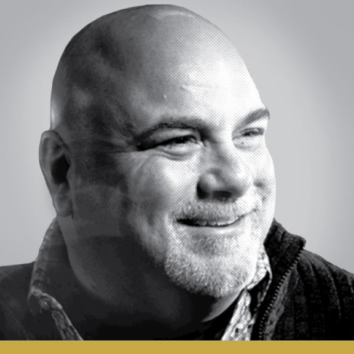

    <h1>Meet Our Judges</h1>

    

        

            

                
Jan 26th

                
Luncheon Speaker

            

            
            <h2 class="gold goudy">Dan Reynolds</h2>
            
Co-Owner, Brave Berlin | Cincinnati,&nbsp;OH

            
NOTABLE CLIENTS

            <ul class="client-list proxima fs">
                <li>Hershey</li>
                <li>Procter & Gamble Co.</li>
                <li>Pepsi</li>
                <li>Ford Motor Company</li>
            </ul>
            
Dan is a co-owner and founding partner of the Cincinnati agency, Brave Berlin. He previously served as a Creative Director at Landor Associates and FRCH Design Worldwide where he created media experiences for some of the most recognized brands in the world, including Disney, Hilton Hotels, Under Armour and Procter & Gamble. In 2013 he formed Brave Berlin with longtime collaborator, Steve McGowan. Brave Berlin provides creative, design and media production services for companies and individuals with a story to tell or a big idea to spread. Their work exists at the crossroads of entertainment, art, strategy and commerce. They have created media brand experiences for clients like Hershey, Pepsi, Procter & Gamble and Ford Motor Company but are best known for their original entertainment productions like Lumenocity, a multi-sensorial collaboration with the Cincinnati Symphony Orchestra. In 2017 they produced Blink, a four-day art event featuring 22 architectural projection mappings and 50 other light-based attractions for the city of Cincinnati. Blink attracted more than 1 million people and became the largest event ever held in the city of Cincinnati.

            
Follow Dan: 

        

        

            
            <h2 class="gold goudy">Gregory DiBisceglie</h2>
            
Senior Creative Manager, Macy’s | New&nbsp;York&nbsp;City

            
Gregory is responsible for concepting, designing and executing national advertising campaigns for annual Macy’s Iconic Events, including: Thanksgiving Day Parade, 4th of July Fireworks, Flower Shows, Holiday Events, Fashion's Front Row and Glamorama — all cornerstones in the Magic of Macy’s strategy and inseparable from the brand identity. His main objective is to ensure that all communications build toward a cohesive brand experience through partnering with Annual and Regional Events Marketing, Digital Media, In-Store Visual, Broadcast, Production, Public Relations and Operations.

            
He believes that illustration can be a powerful tool for communicating strong ideas, connecting emotionally with users and creating an experience that feels truly unique. His collaboration with illustrators and photographers from around the world has proven to be what he considers the highlight of his career at Macy’s.

            
Follow Gregory: 

        

        

            

            

            
            <h2 class="gold goudy">Scott Spooner</h2>
            
Copywriter, The Richards Group | Dallas,&nbsp;TX

            
NOTABLE CLIENTS

            <ul class="client-list proxima fs">
                <li>Sonic</li>
                <li>Cisco Systems</li>
                <li>Ram Trucks</li>
                <li>Blue Plate Mayonnaise</li>
            </ul>
            
Scott Spooner is a currently a writer at The Richards Group in Dallas, TX. Before joining Richards, Scott worked at Goodby Silverstein & Partners in San Francisco and several other Dallas agencies. He has worked on a wide array of clients including Cisco Systems, Ram Trucks, Sonic and Blue Plate Mayonnaise. During his career, he has been the recipient of numerous awards from the American Advertising Awards, Communication Arts, Graphis and HOW Design.

            
Follow Scott: 

        

    

