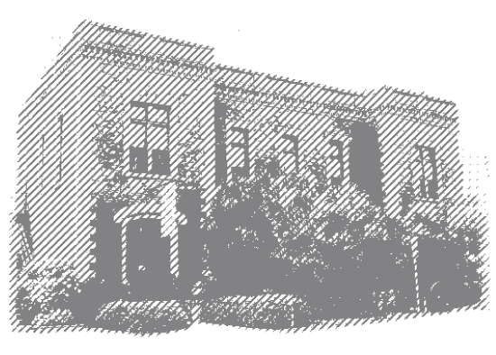

    <h1>Purchase Tickets</h1>

	<h3>2018 American Advertising Awards</h3>
    <h2 class="gold f2" style="padding:30px 0 20px 0;">Saturday, February 24</h2>
    <h2 class="white f4" style="line-height:2.5rem; padding-bottom:20px;">Hope Lodge 145 116 E Vermillion Street 6:30 pm</h2>
    

        
Join us on for an industry-wide celebration to recognize advertising excellence among local creatives and strategists. Enjoy an evening of awards, cocktails, silent auction and tarot readings. Black coctail attire preferred. Robes and masks encouraged.

        
Each ticket will include dinner and two drink tickets for your choice of domestic beer or house wine. A cash bar will also be available. After the ceremony, the official after-party will be upstairs at the 2nd&nbsp;Floor&nbsp;Nightclub.

    <h3 class="gold">Ticket Sales End February 16</h3>
    

    

        
    

	

		
    

    <h2 class="gold mv3">About the Venue</h2>
    

        
Built by Masons, Hope Lodge 145 was built in 1916 as a beautifully ornate, Gothic Revival-style structure. It's location in Downtown Lafayette, directly across the street from the parking garage, makes this the ideal location for our Order's ceremony. (Attendees may recognize this spot as the former Stan's and Sizzling Monkey.)

        
And while the downstairs space serves as an elegant event venue, the upstairs transforms into the 2nd Floor Nightclub.

    

	

		
    

    <h2 class="gold mv3">Tarot Readings</h2>
    

        
In-Tune Tarot provides insights and guidance based on interactions with and reflections on the 78 cards of the Tarot deck. Elizabeth Sonnier is an experienced reader, teacher and artist. Allow the Tarot to guide your decisions in all areas of your life from work, finances, and career to relationships, love, and spirituality.

        
Please note, attendees to purchase their own readings.

    

